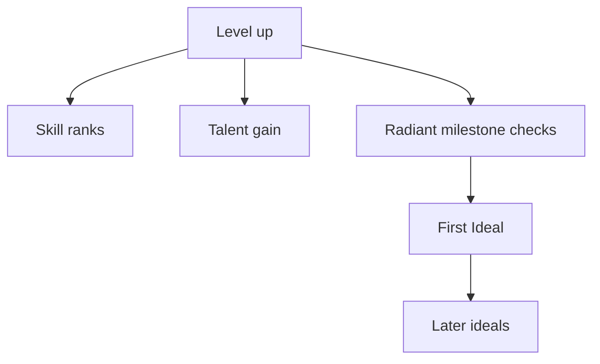

# Advancement / Level-Up Rules (Levels 2–20)

## Rule summary table
| Area | Summary | Notes |
| --- | --- | --- |
| Level gains | Each level grants specific gains. | Skills, talents, and path features. |
| Skill rank caps | Enforce max rank by level. | Track total ranks gained. |
| Talent choices | Gain talents at defined milestones. | Enforce prerequisites. |
| Radiant unlocks | Radiant path gains are gated. | First Ideal and later ideals. |

## Dependencies / prerequisites graph

## Example edge cases
- Attempting to select a talent without required prerequisites (invalid).
- Exceeding skill rank caps at the current level (invalid).
- Unlocking surge features before First Ideal (invalid).

## Source references
- TODO: Stormlight Handbook PDF page citations for each rule above.
