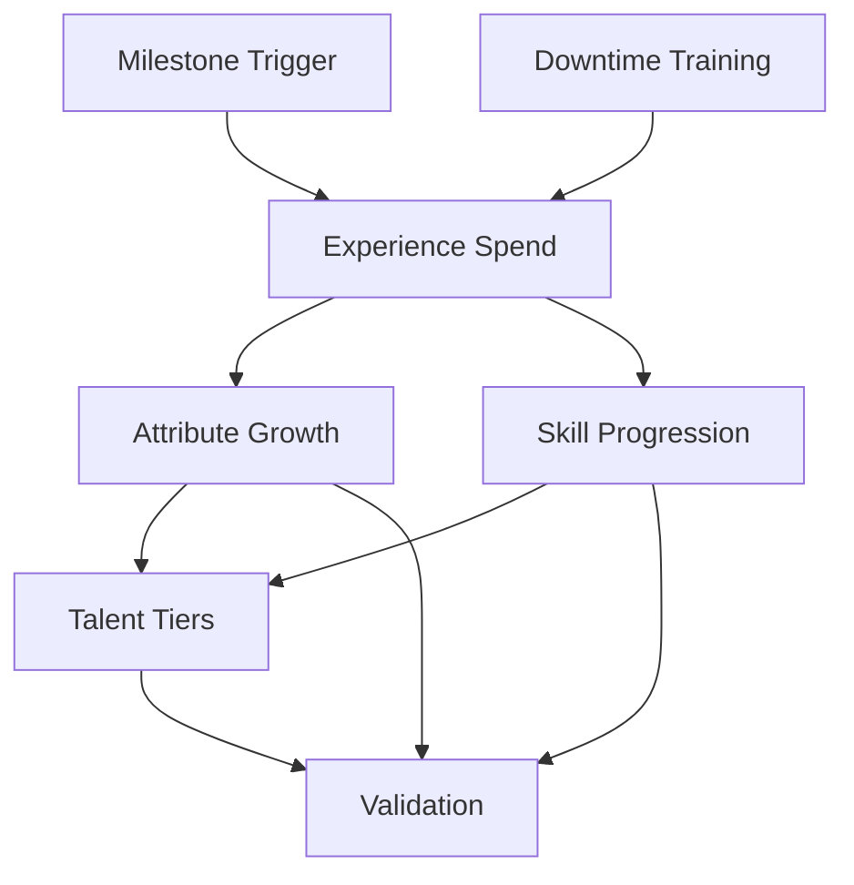

# Advancement Rules Reference

## Rule Summary Table

| Rule Area | Summary | Key Outputs | Stormlight Handbook PDF |
| --- | --- | --- | --- |
| Milestone Triggers | Advancement granted at story milestones or session benchmarks. | Advancement eligibility. | pp. 40-42 |
| Experience Spend | Spend earned points on attributes, skills, and talents. | Updated progression log. | pp. 43-46 |
| Attribute Growth | Attribute increases cost scaling and are capped by tier. | New attribute caps. | pp. 47-48 |
| Skill Progression | Skills increase with escalating costs and prerequisites. | Skill ranks and focus tags. | pp. 49-52 |
| Talent Tiers | Talents unlocked by tier gates and prerequisite chains. | New talents, tier unlocks. | pp. 53-56 |
| Downtime Training | Optional downtime activities convert time into advancement. | Training ledger. | pp. 57-58 |
| Validation | Ensure spend totals and prerequisites match rules. | Compliance report. | pp. 59-60 |

## Prerequisites & Dependencies

## Example Edge Cases

- **Tier unlock without prerequisites:** A player meets tier level but lacks a required skill rank; disallow tiered talent purchase until skill prerequisites are met.
- **Over-spend detection:** Spending more advancement points than earned; require rollback to last valid state.
- **Downtime stacking:** Multiple downtime activities grant overlapping bonuses; enforce the rule that only the highest bonus applies.
- **Attribute cap mismatch:** Attribute cap increases but the player tries to exceed the tier maximum; enforce the cap before calculating derived stats.

## Page References

- Milestone and experience rules: pp. 40-46.
- Attribute/skill advancement costs: pp. 47-52.
- Talent tier unlocks: pp. 53-56.
- Downtime training: pp. 57-58.
- Advancement validation checklist: pp. 59-60.
