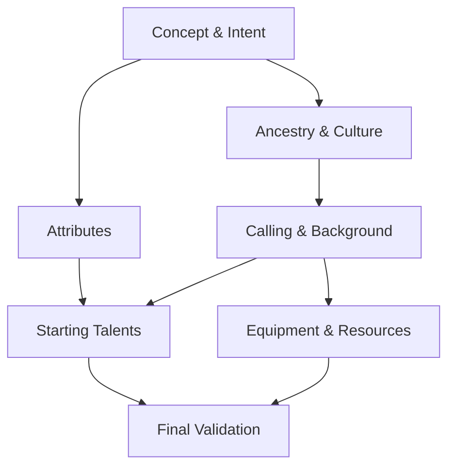

# Character Creation Rules Reference

## Rule Summary Table

| Rule Area | Summary | Key Outputs | Stormlight Handbook PDF |
| --- | --- | --- | --- |
| Concept & Intent | Define character concept, narrative role, and campaign fit before mechanics. | Concept statement, role tags. | pp. 4-7 |
| Attribute Baseline | Assign baseline attributes with a fixed pool and minimum/maximum caps. | Attribute scores, derived modifiers. | pp. 8-11 |
| Ancestry & Culture | Select ancestry/culture package with traits, languages, and starting feature. | Heritage traits, language list. | pp. 12-16 |
| Calling & Background | Pick a calling and background that grant skills and starting resources. | Skill ranks, background perks. | pp. 17-21 |
| Starting Talents | Choose starting talents within tier limits and prerequisites. | Talent list, tier flags. | pp. 22-26 |
| Equipment & Resources | Allocate starting gear and currency based on background. | Item list, starting wealth. | pp. 27-30 |
| Final Validation | Verify prerequisites, caps, and campaign constraints. | Validation report. | pp. 31-32 |

## Prerequisites & Dependencies

## Example Edge Cases

- **Over-cap attributes:** A player assigns an attribute above the maximum after ancestry bonuses. Require reallocation before talents are chosen.
- **Conflicting heritage and background:** A background prerequisite calls for a language not granted by chosen culture; enforce selecting a compatible background or adding the language via a talent swap.
- **Starting gear duplication:** A kit provides a weapon already granted by background; replace with equivalent value item rather than stacking duplicates.
- **Talent prerequisite chain:** A starting talent requires a tier-1 talent from another path; ensure the base talent is selected first and within starting tier limits.

## Page References

- Character concept overview: pp. 4-7.
- Attribute allocation rules: pp. 8-11.
- Ancestry/culture packages: pp. 12-16.
- Calling/background selection: pp. 17-21.
- Starting talents & equipment: pp. 22-30.
- Final validation checklist: pp. 31-32.
