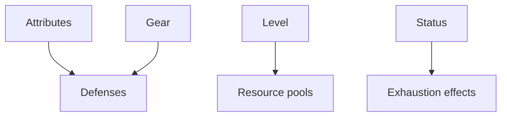

# Combat & Resource Tracking Rules

## Rule summary table
| Area | Summary | Notes |
| --- | --- | --- |
| Defenses | Derived from attributes and gear. | Update live in sheet. |
| Resources | Health, focus, investiture. | Track spends and recovery. |
| Exhaustion | Applies penalties at thresholds. | Track states. |

## Dependencies / prerequisites graph

## Example edge cases
- Resource pools not recalculated after attribute changes (invalid).
- Exhaustion penalties not applied to derived stats (invalid).

## Source references
- TODO: Stormlight Handbook PDF page citations for each rule above.
