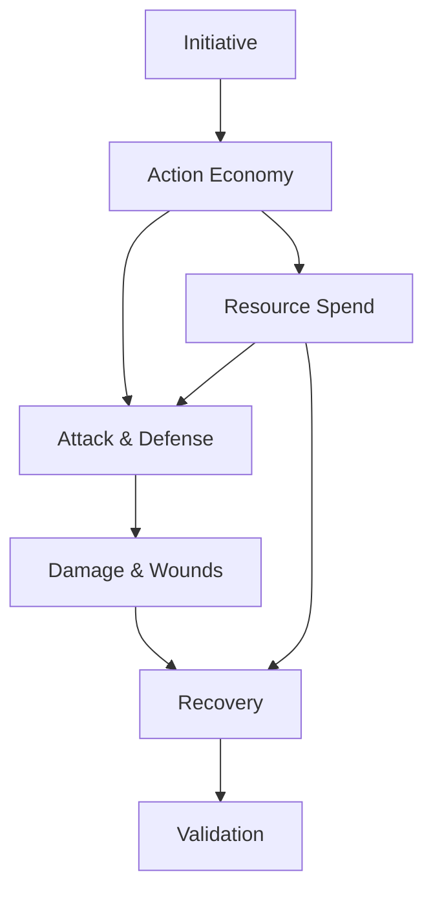

# Combat & Resources Rules Reference

## Rule Summary Table

| Rule Area | Summary | Key Outputs | Stormlight Handbook PDF |
| --- | --- | --- | --- |
| Initiative | Determine turn order with awareness of ambush and surprise. | Initiative order. | pp. 100-102 |
| Action Economy | Each round grants standard, move, and reactive actions. | Action tracking. | pp. 103-106 |
| Attack & Defense | Resolve attacks with rolls, modifiers, and defense thresholds. | Hit/miss results. | pp. 107-111 |
| Damage & Wounds | Apply damage, track wounds, and trigger conditions. | Wound track updates. | pp. 112-115 |
| Resource Spend | Spend stamina, Stormlight, or focus to modify outcomes. | Resource ledger. | pp. 116-118 |
| Recovery | End-of-round and post-combat recovery rules. | Resource recovery log. | pp. 119-121 |
| Validation | Ensure actions and resources follow limits. | Combat compliance report. | pp. 122-123 |

## Prerequisites & Dependencies

## Example Edge Cases

- **Interrupted action:** A reaction interrupts a standard action; resolve the reaction first, then resume or cancel the interrupted action based on result.
- **Resource overspend:** A player tries to spend more stamina than available; deny the spend and roll without the bonus.
- **Simultaneous triggers:** Two damage triggers fire at once; resolve in initiative order or per GM discretion, but log both.
- **Downed but not out:** Wound track hits zero but has a conditional buffer; apply the buffer before declaring unconscious.

## Page References

- Initiative and action economy: pp. 100-106.
- Attacks, defense, and damage: pp. 107-115.
- Resource spending and recovery: pp. 116-121.
- Combat validation checklist: pp. 122-123.
