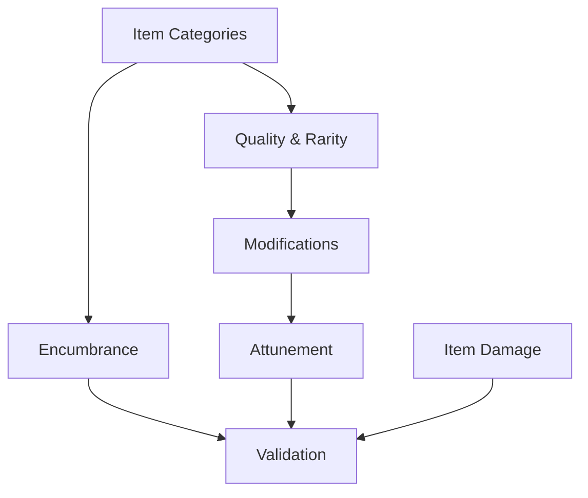

# Item Rules Reference

## Rule Summary Table

| Rule Area | Summary | Key Outputs | Stormlight Handbook PDF |
| --- | --- | --- | --- |
| Item Categories | Items grouped by weapon, armor, tool, and relic categories. | Category tags. | pp. 130-132 |
| Quality & Rarity | Quality tiers affect bonuses, rarity affects availability. | Item quality rating. | pp. 133-135 |
| Modifications | Upgrades require materials, downtime, and skill checks. | Modification log. | pp. 136-139 |
| Encumbrance | Carry limits based on strength and pack capacity. | Encumbrance totals. | pp. 140-142 |
| Attunement | Some relics require attunement slots and rituals. | Attunement slots used. | pp. 143-144 |
| Item Damage | Items degrade or break under stress conditions. | Item condition track. | pp. 145-147 |
| Validation | Confirm category restrictions and encumbrance caps. | Item compliance report. | pp. 148-149 |

## Prerequisites & Dependencies

## Example Edge Cases

- **Encumbrance overflow:** Adding a heavy relic exceeds carry capacity; enforce movement penalties immediately.
- **Duplicate attunement:** Attempt to attune two relics to the same slot; deny the second unless a slot is freed.
- **Broken item use:** Item condition reaches broken yet is still used in combat; apply disadvantage or treat as unusable.
- **Modification prerequisite:** Upgrade requires a tool proficiency the character lacks; block until prerequisite is met.

## Page References

- Item categories and quality: pp. 130-135.
- Modifications and encumbrance: pp. 136-142.
- Attunement and item damage: pp. 143-147.
- Item validation checklist: pp. 148-149.
