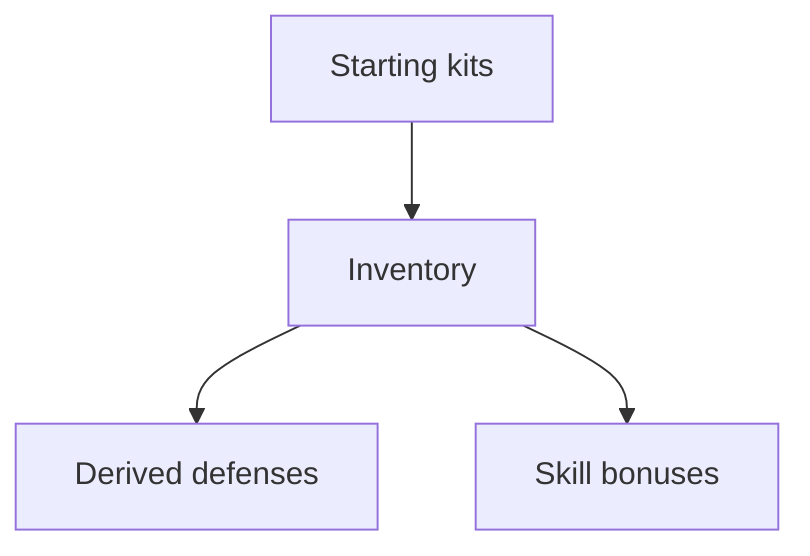

# Item Rules

## Rule summary table
| Area | Summary | Notes |
| --- | --- | --- |
| Weapons | Define damage, traits, and ranges. | Use item traits. |
| Armor | Provide defense modifiers. | Update derived defenses. |
| Tools | Provide skill bonuses. | Apply to skill checks. |
| Starting kits | Define default loadouts. | Populate inventory. |

## Dependencies / prerequisites graph

## Example edge cases
- Equipping armor without applying defense modifiers (invalid).
- Item traits missing required fields (invalid).

## Source references
- TODO: Stormlight Handbook PDF page citations for each rule above.
