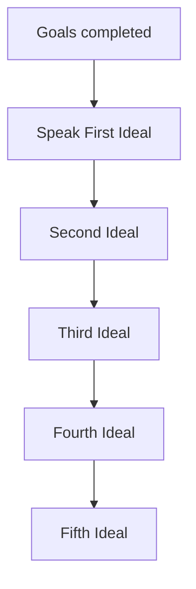

# Radiant Progression Rules

## Rule summary table
| Area | Summary | Notes |
| --- | --- | --- |
| First Ideal | Required to access Investiture and Radiant features. | Triggered by goal completion. |
| Later ideals | Unlock surges and additional features. | Must meet prerequisites. |
| Goals | Goals drive advancement triggers. | Link to story metadata. |

## Dependencies / prerequisites graph

## Example edge cases
- Attempting to unlock a surge without completing First Ideal (invalid).
- Goals lacking milestone metadata for advancement triggers (invalid).

## Source references
- TODO: Stormlight Handbook PDF page citations for each rule above.
