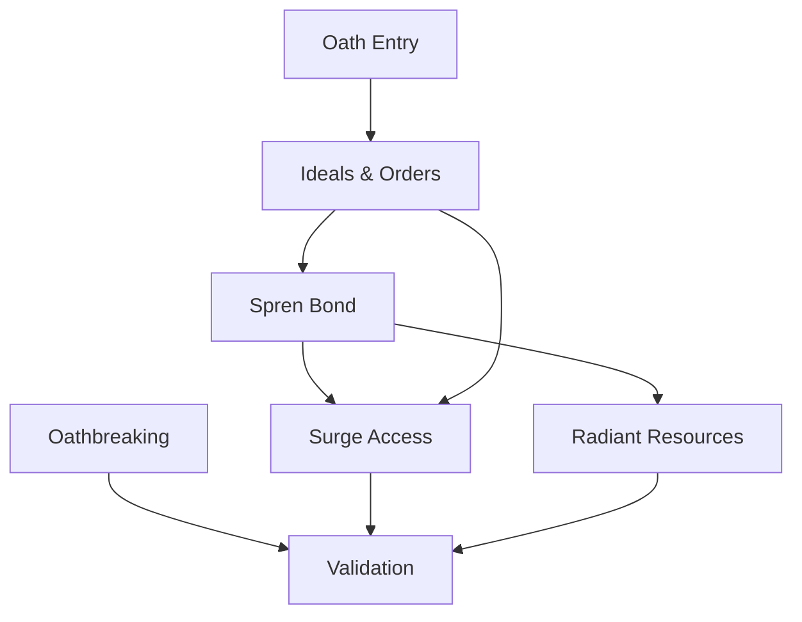

# Radiant Progression Rules Reference

## Rule Summary Table

| Rule Area | Summary | Key Outputs | Stormlight Handbook PDF |
| --- | --- | --- | --- |
| Oath Entry | Initial bond requirements and narrative trigger for oath entry. | Oath entry status. | pp. 70-72 |
| Ideals & Orders | Selecting ideals and orders with distinct prerequisites. | Order selection, ideal rank. | pp. 73-76 |
| Spren Bond | Bond strength tracks progression and unlocks surges. | Bond level, surge list. | pp. 77-80 |
| Surge Access | Surge tiers unlocked at specified ideal milestones. | Surge tier access. | pp. 81-83 |
| Radiant Resources | Stormlight and related resources scale with bond level. | Resource cap and recovery. | pp. 84-86 |
| Oathbreaking | Consequences for violating ideals, including regression. | Regression flags, penalties. | pp. 87-88 |
| Validation | Verify bond, ideals, and surge prerequisites. | Radiant validation log. | pp. 89-90 |

## Prerequisites & Dependencies

## Example Edge Cases

- **Order mismatch:** A character attempts to select a surge not available to their order; disallow until order change event is approved.
- **Bond regression:** Breaking an ideal lowers bond level, which removes surge access; flag any actions relying on those surges.
- **Stormlight cap overflow:** Resource pool exceeds cap after a milestone bonus; reduce to cap and log the overflow.
- **Dual progression:** Character with advancement tier increase but no ideal advancement; keep surge tier locked until ideals progress.

## Page References

- Oath entry and order selection: pp. 70-76.
- Spren bond and surge access: pp. 77-83.
- Stormlight resources: pp. 84-86.
- Oathbreaking consequences: pp. 87-88.
- Radiant progression validation: pp. 89-90.
